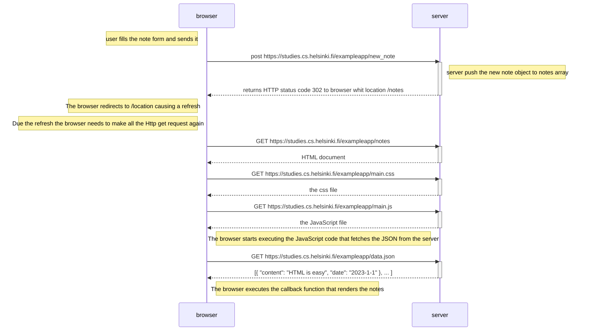

```mermaid
sequenceDiagram
    participant browser
    participant server

  
    Note left of browser: user fills the note form and sends it  
    browser->>server: post https://studies.cs.helsinki.fi/exampleapp/new_note
    activate server
    Note right of server: server push the new note object to notes array
    server-->>browser: returns HTTP status code 302 to browser whit location /notes
    deactivate server

    Note left of browser: The browser redirects to /location causing a refresh
    Note left of browser: Due the refresh the browser needs to make all the Http get request again
   
   browser->>server: GET https://studies.cs.helsinki.fi/exampleapp/notes
    activate server
    server-->>browser: HTML document
    deactivate server

    browser->>server: GET https://studies.cs.helsinki.fi/exampleapp/main.css
    activate server
    server-->>browser: the css file
    deactivate server

    browser->>server: GET https://studies.cs.helsinki.fi/exampleapp/main.js
    activate server
    server-->>browser: the JavaScript file
    deactivate server

    Note right of browser: The browser starts executing the JavaScript code that fetches the JSON from the server

    browser->>server: GET https://studies.cs.helsinki.fi/exampleapp/data.json
    activate server
    server-->>browser: [{ "content": "HTML is easy", "date": "2023-1-1" }, ... ]
    deactivate server

    Note right of browser: The browser executes the callback function that renders the notes
```