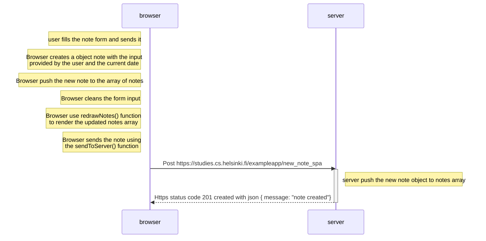

```mermaid
sequenceDiagram
    participant browser
    participant server

    Note left of browser: user fills the note form and sends it
    Note left of browser: Browser creates a object note with the input<br> provided by the user and the current date
    Note left of browser: Browser push the new note to the array of notes
    Note left of browser: Browser cleans the form input
    Note left of browser: Browser use redrawNotes() function <br> to render the updated notes array
    Note left of browser: Browser sends the note using <br>the sendToServer() function

    browser->>server: Post https://studies.cs.helsinki.fi/exampleapp/new_note_spa
    activate server
    Note right of server: server push the new note object to notes array
    server-->>browser: Https status code 201 created with json { message: "note created"}
    deactivate server
```
